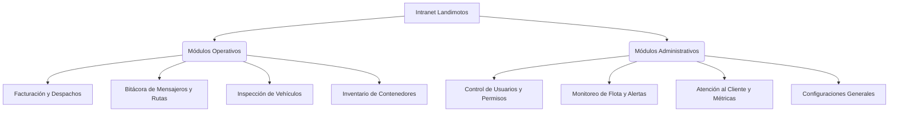

# Documentación del Sistema: Intranet Landimotos v2.1

Esta documentación proporciona un informe detallado y completo del diseño, las funcionalidades, la arquitectura técnica y la utilidad de la **Intranet Landimotos**. Este documento está estructurado de manera que pueda servir como **informe corporativo** para presentar a la junta directiva y al equipo técnico de la empresa.

---

## 1. Introducción y Objetivo del Sistema

La **Intranet Landimotos** es una plataforma web centralizada de nivel empresarial diseñada para integrar, automatizar y supervisar las operaciones diarias de la compañía. Su objetivo principal es optimizar la comunicación entre el personal operativo (mensajeros y operarios de despacho) y el equipo administrativo.

### Utilidad Comercial e Impacto Operativo
- **Eliminación del Papel:** Digitalización del control preoperacional diario y el registro de despachos.
- **Trazabilidad en Tiempo Real:** Seguimiento de rutas activas de mensajería, tiempos de almuerzo y estado de la flota.
- **Control de Cumplimiento:** Bloqueo de inicio de jornada si no se realiza la inspección vehicular obligatoria.
- **Seguridad de Datos:** Gestión granular de accesos para asegurar que cada empleado visualice únicamente las herramientas necesarias para su labor.

---

## 2. Arquitectura de Diseño y Stack Tecnológico

El proyecto está diseñado siguiendo las pautas de las aplicaciones web modernas, priorizando el rendimiento, la escalabilidad y una experiencia de usuario (UX) premium con diseño responsivo, paleta de colores oscura y efectos visuales fluidos.

* **Core Framework:** [Next.js 16 (App Router)](https://nextjs.org/) utilizando la estructura de carpetas agrupadas por layouts funcionales.
* **Lenguaje:** [TypeScript](https://www.typescriptlang.org/) para un desarrollo tipado, reduciendo errores en tiempo de ejecución.
* **Estilos y UX:** [TailwindCSS v4](https://tailwindcss.com/) para estilos ágiles, acompañado de [Lucide Icons](https://lucide.dev/) para representación iconográfica limpia y coherente.
* **Base de Datos y Autenticación:** [Supabase](https://supabase.com/) como Backend-as-a-Service, proveyendo:
  - **Supabase Auth:** Control de sesiones persistentes y seguras a nivel de cliente y servidor (SSR).
  - **Supabase Database (PostgreSQL):** Almacenamiento relacional de datos.
  - **Políticas RLS (Row Level Security):** Seguridad integrada a nivel de base de datos para impedir accesos no autorizados a registros específicos.

---

## 3. Módulos del Sistema y Funcionalidades

El sistema se divide en **dos grandes perspectivas**: la **Vista Operativa** (para el personal de campo y distribución) y la **Vista Administrativa** (para los gestores de recursos y directores).

### A. Módulos Operativos (Uso Diario)

#### 1. Módulo de Despachos e Invoices (`/despachos`)
- **Utilidad:** Permite a los operarios registrar las facturas y despachos correspondientes a cada punto de venta en tiempo real.
- **Funciones:**
  - Formulario de Registro: Ingreso de número de factura, punto (Principal/Sucursal), área, mesa y revisor.
  - Tabla de Registros: Listado paginado con buscador inteligente de facturas del mes en curso.
  - Indicadores Administrativos (Solo Admin): Vista de estadísticas consolidadas del mes.

#### 2. Módulo de Mensajeros e Historial de Rutas (`/mensajeros`)
- **Utilidad:** Gestión de distribución física, disponibilidad y asignación de despachos.
- **Funciones:**
  - **Asignación de Rutas:** Permite despachar conductores a ubicaciones específicas indicando número de pedidos y facturas asociadas.
  - **Control de Disponibilidad:** Registro en tiempo real del estado de los mensajeros (`Disponible`, `En Ruta`, `En Almuerzo`, `Inactivo`).
  - **Bitácora de Almuerzos:** Los conductores pueden registrar su salida y retorno de almuerzo, calculando de forma automática el tiempo transcurrido en el día.
  - **Buscador de Facturas:** Herramienta rápida para localizar qué mensajero lleva o llevó una factura específica.
  - **Reportes (Solo Admin):** Exportación en formato CSV de todo el historial de rutas por rangos de fechas personalizados y gráficos de productividad (pedidos entregados, picos de salidas por horas y destinos frecuentes).

#### 3. Control Diario de Vehículos (`/vehiculos`)
- **Utilidad:** Garantizar que los vehículos operen en condiciones seguras y vigilar el kilometraje de la flota.
- **Funciones:**
  - **Checklist Diario Obligatorio:** Formulario detallado que evalúa el estado de: Luces, Frenos, Llantas/Suspensión, Retrovisores, Aceite de Motor, Líquido de Frenos, Carrocería y Documentación.
  - **Generación de Alertas:** Si algún elemento es marcado en estado crítico ("Mal"), el sistema genera automáticamente una alerta para el administrador y cambia el estado del vehículo en la flota.
  - **Historial de Reportes:** Tabla con los registros de inspección recientes asociados al conductor logueado.

#### 4. Inventario de Contenedores (`/inventarios`)
- **Utilidad:** Control y seguimiento físico de los contenedores de carga y transporte.
- **Funciones:**
  - Registro de contenedores con código único y descripción.
  - Actualización de estado del contenedor (`Disponible`, `En Uso`, `Mantenimiento`).

---

### B. Módulos Administrativos (Consola de Control)

#### 1. Administración de Usuarios y Permisos (`/admin/usuarios`)
- **Utilidad:** Administrar las cuentas del personal y conceder accesos controlados.
- **Funciones:**
  - **Configuración de Roles:** Permite definir perfiles como `Administrador` (acceso completo) u `Operativo` (acceso restringido).
  - **Habilitación de Secciones (Módulos):** Panel interactivo para activar o desactivar dinámicamente el acceso de cada usuario a los módulos de: **Despachos**, **Mensajeros** y **Vehículos**.
  - **Control de Estado:** Activar o suspender cuentas de usuario (`Activo` / `Inactivo`).

#### 2. Consola de Vehículos y Alertas (`/vehiculos` - Vista Admin)
- **Utilidad:** Monitoreo técnico de la flota para prevenir accidentes y gestionar mantenimientos.
- **Funciones:**
  - **Fallas e Irregularidades:** Panel de alertas activas donde el administrador puede revisar las fallas reportadas por los conductores en sus checklists y cerrarlas agregando comentarios técnicos una vez solucionadas.
  - **Mantenimiento de Flota:** Crear nuevos vehículos, editar kilometraje acumulado o dar de baja.
  - **Historial General de Controles:** Consulta detallada de todas las inspecciones mecánicas realizadas en la empresa con filtros avanzados de fechas y placas.

#### 3. Administración de Personal de Conductores (`/admin/mensajeros`)
- **Utilidad:** Gestión legal y documental de los conductores.
- **Funciones:**
  - Registro de datos del conductor: Cédula, Nombre Completo, Cargo, Foto de perfil y Placa del vehículo asignado.
  - **Control de Vencimiento de Documentación:** Seguimiento a las fechas de expiración de:
    - **SOAT**
    - **Revisión Técnico-Mecánica**
    - **Licencia de Conducción** (con categoría asociada, ej. A2, B2, C2).

#### 4. Módulo de Atención al Cliente (`/admin/atencion`)
- **Utilidad:** Bitácora para el control de los asesores de servicio al cliente y temáticas de chat de WhatsApp.
- **Funciones:**
  - **Estadísticas de Asesores:** Monitoreo del total de clientes atendidos por asesor (ej. Carolina Rojas, Sebastián Gómez, Marcela Silva).
  - **Etiquetas de Categorización:** Registro de contactos por categoría (Ventas, Soporte Técnico, Garantías, Información General, Reclamos, Otros).
  - **Planificador de WhatsApp:** Programación y cumplimiento de estados o temáticas promocionales diarias.

#### 5. Configuración de Campos (`/admin/configuracion`)
- **Utilidad:** Mantenimiento de variables globales del sistema (ej. listado oficial de revisores autorizados en despachos).

---

## 4. Arquitectura de Seguridad y Autorización

La seguridad de la intranet se ha estructurado en tres capas independientes para garantizar un blindaje completo:

1. **Capa 1: Sesión a Nivel de Servidor (SSR)**
   - El archivo [`layout.tsx`](file:///c:/Users/compu/OneDrive/Documentos/intranet_landi-v2.1/src/app/(dashboard)/layout.tsx) evalúa la sesión del usuario mediante cookies seguras antes de renderizar la página. Si la sesión no existe, redirige automáticamente al portal de `/login`.

2. **Capa 2: Autorización Dinámica en el Sidebar**
   - El componente [`Sidebar.tsx`](file:///c:/Users/compu/OneDrive/Documentos/intranet_landi-v2.1/src/components/layout/Sidebar.tsx) oculta dinámicamente las secciones del menú para las cuales el usuario operativo no ha sido habilitado desde el panel de administración.

3. **Capa 3: Protección a Nivel de Ruta (Page Protection)**
   - Cada página operativa (`despachos`, `mensajeros` y `vehiculos`) consulta en su carga inicial los permisos concedidos al perfil del usuario. Si un usuario intenta saltarse el menú e ingresar directamente digitando la URL, el sistema bloquea el renderizado y muestra una pantalla de **Acceso Denegado**.

---

## 5. Conclusiones y Próximos Pasos

La **Intranet Landimotos** se encuentra actualmente en su **versión 2.1**, completamente estable, compilada y optimizada para producción. Representa una herramienta de alto valor estratégico que centraliza la administración operativa e incrementa significativamente la eficiencia y control de la empresa.

**Futuras mejoras recomendadas:**
- Implementación de notificaciones automáticas vía WhatsApp ante la generación de alertas mecánicas.
- Módulo de recordatorios automáticos por correo electrónico 15 días antes del vencimiento de la licencia, SOAT o técnico-mecánica de cada conductor.
